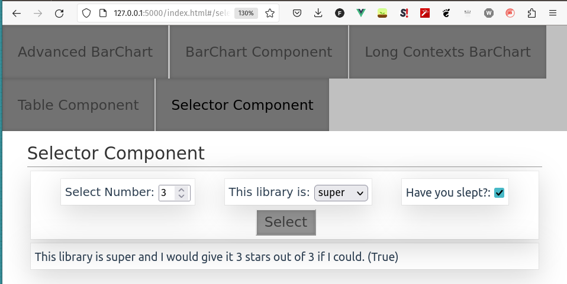
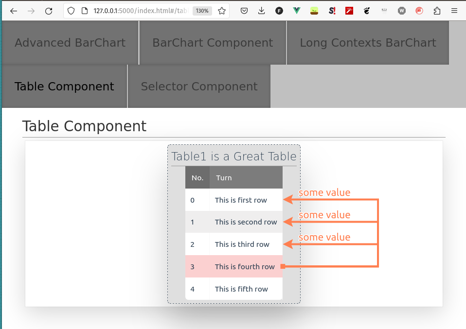

# Conditional Language Model Generation Visualization

## VERSION: `0.0.9`

- when evaluating language models it is often pain to see what is generated and why
- this little package is a `vue.js` frontend together with `flask` backend and it is designed to easily show some interesting visualizations on conditional generation models
- it handles frontend-backend communication as well as frontend rendering
- hence the developper can focus only on ML aspects of his work!

## Installation

- install from pypi:
  - `pip install llm-generation-server`
- install directly from git:
  - `pip install git+https://github.com/gortibaldik/visualize_llm_generation#egg=llm_generation_server`

## Usage

The library is composed of three parts:

1. Server - `llm_generation_server.server.Server`
2. Component - `llm_generation_server.component_base.ComponentBase`
3. Elements - `llm_generation_server.elements.*`

### Expected Workflow

1. Create a class inheriting from `llm_generation_server.component_base.ComponentBase`. In `__init__` you should:

- create all the elements from which the page should be composed

<!-- MARKDOWN-AUTO-DOCS:START (CODE:src=./examples_py/simple_component.py&lines=1-15&header=# ./examples_py/simple_component.py lines 1-15)-->
<!-- MARKDOWN-AUTO-DOCS:END-->

- call `super().__init__`, where you specify name and title of the component as well as the created elements in the order that they should appear in the page

<!-- MARKDOWN-AUTO-DOCS:START (CODE:src=./examples_py/simple_component.py&lines=16-21&header=# ./examples_py/simple_component.py lines 16-21)-->
<!-- MARKDOWN-AUTO-DOCS:END-->

2. Initialize `llm_generation_server.server.Server` and pass in the initialized components

<!-- MARKDOWN-AUTO-DOCS:START (CODE:src=./examples_py/simple_app.py&lines=1-7&header=# ./examples_py/simple_app.py)-->
<!-- MARKDOWN-AUTO-DOCS:END-->

3. Standard method to run the flask application, e.g. for the example provided above, it would be

```sh
python3 -m flask --app examples_py.simple_app run
```


### Implemented Elements

I wrote this library to help me visualize the output distributions of various models I implemented during my master's thesis. Therefore I implemented only few basic elements for ML purposes.

#### Configuration Selection

Several different kinds of configuration specifier, together with one button element. The button element allows backend communication and by itself it does nothing. However you can specify subelements, for which the button element will provide communication updates. For the example below, the following imports will be used:

<!-- MARKDOWN-AUTO-DOCS:START (CODE:src=./examples_py/selector_component.py&lines=1-8&header=# ./examples_py/selector_component.py lines 1-8)-->
<!-- MARKDOWN-AUTO-DOCS:END-->

##### MinMax SubElement

Input element for setting integer in a range.

<!-- MARKDOWN-AUTO-DOCS:START (CODE:src=./examples_py/selector_component.py&lines=11-16&header=# ./examples_py/selector_component.py lines 11-16)-->
<!-- MARKDOWN-AUTO-DOCS:END-->

##### Choices SubElement

Input element for choosing between several choices.

<!-- MARKDOWN-AUTO-DOCS:START (CODE:src=./examples_py/selector_component.py&lines=17-19&header=# ./examples_py/selector_component.py lines 17-19)-->
<!-- MARKDOWN-AUTO-DOCS:END-->

##### Checkbox SubElement

Simple checkbox input element.

<!-- MARKDOWN-AUTO-DOCS:START (CODE:src=./examples_py/selector_component.py&lines=20-20&header=# ./examples_py/selector_component.py lines 20)-->
<!-- MARKDOWN-AUTO-DOCS:END-->

##### Button Element

This is an element that should encapsulate all the other configuration selection elements. It needs a callback method that will be called when the button is pressed and we provide `ButtonElement.default_select_callback()` which handles processing all the changes sent from the frontend and attributing them to `subelement.selected` properties of subelements.

<!-- MARKDOWN-AUTO-DOCS:START (CODE:src=./examples_py/selector_component.py&lines=21-50&header=# ./examples_py/selector_component.py lines 21-50)-->
<!-- MARKDOWN-AUTO-DOCS:END-->

###### Show-Case

You can see the generated page by running the following script after cloning the github repository and navigating into it:

```sh
flask --app examples_py.app run
```

You can also see that there are several tabs at the top of the page, each tab refers to one `ComponentBase` implementation registered on the `Server` instance.

<!-- MARKDOWN-AUTO-DOCS:START (CODE:src=./examples_py/app.py&header=# ./examples_py/app.py)-->
<!-- MARKDOWN-AUTO-DOCS:END-->



#### Table Element

This element can show several tables on the frontend together with a special feature, links between rows of the tables. They may connect different rows of different tables and display some value above links.

<!-- MARKDOWN-AUTO-DOCS:START (CODE:src=./examples_py/table_component.py&header=# ./examples_py/table_component.py)-->
<!-- MARKDOWN-AUTO-DOCS:END-->



#### BarChart Element

This element displays a horizontal barchart together with radio input elements and a button to send the selected value to the backend. Again, you must provide `endpoint_callback` where the response from the server will be processed.

###### THIS IS THE ONLY SECTION NOT AUTOGENERATED FROM THE CODE, BIG TODO!

```python
from llm_generation_server.elements.barchart_element import BarChartElement

self.softmax_element = BarChartElement(
    n_largest_tokens_to_return=10,
    endpoint_callback=self.select_next_token,
    names=["Estimated Probability"],
    selectable=True,
)
self._initialize_vocab()

def select_next_token(self):
    if not request.is_json:
        return jsonify(dict(result="failure"))
    token: str = request.get_json().get("token")
    # do something with the token
    # return all the changed elements configurations to the frontend
    return self.initial_fetch()

# =======================================================================
# some boilerplate to return 20 random words with 20 random probabilities
def get_next_token_predictions(self):
    n = self.softmax_element.n_largest_tokens_to_return
    K = n * 3
    twenty_ixes = random.choices(self.ix_arr, k=K)
    twenty_probs = [random.random() for _ in range(K)]
    twenty_probs = np.exp(twenty_probs)
    twenty_probs /= np.sum(twenty_probs)
    probs = np.zeros((len(self.word_vocab), 1))
    probs[twenty_ixes, 0] = twenty_probs * 100
    return probs

def initial_fetch(self, fetch_all=True):
    probs = self.get_next_token_predictions()
    words = self.softmax_element.assign_words_to_probs(probs, self.word_vocab)
    self.softmax_element.possibilities = words

    return super().fetch_info(fetch_all=fetch_all)

def _initialize_vocab(self):
    word_site = "https://www.mit.edu/~ecprice/wordlist.10000"
    response = requests.get(word_site)
    self.word_vocab = [x.decode("utf-8") for x in response.content.splitlines()]
    self.ix_arr = list(range(len(self.word_vocab)))
```


## More Elaborate Example

More elaborate example can be found in [`app.py`](https://github.com/gortibaldik/visualize_llm_generation/app.py) and [`examples_py/*`](https://github.com/gortibaldik/visualize_llm_generation/examples_py/). The example frontend generated by such an application is shown below.


