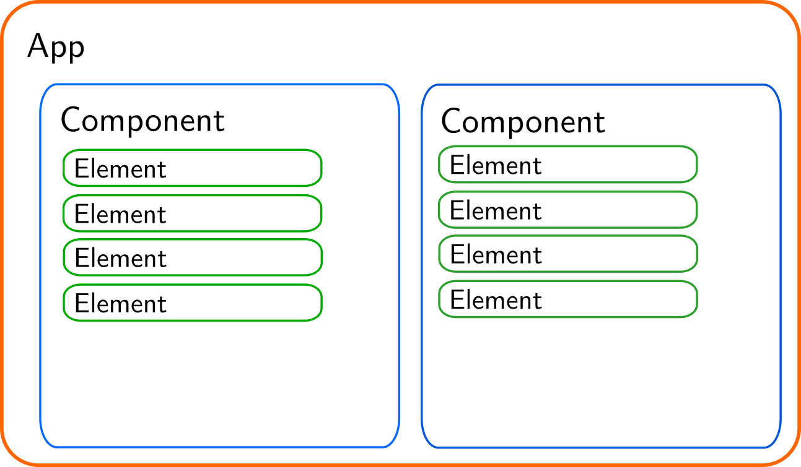

# Documentation of Communication between BE and FE

User navigates to the web-page where the frontend is hosted (e.g. after running `flask run` it should be on `http://localhost:5000`)

1. The frontend calls `<api_host>/fetch_component_infos` from where it obtains 3 pieces of information about each component:
   - name of the component (this will be converted to path, e.g. if the component has name 'gortibaldik' its path will be '/gortibaldik' and the backend ensures that there are no two components with the same name by adding a suffix after the component name, e.g. 'gortibaldik', 'gortibaldik_2', 'gortibaldik_3'...)
   - title of the component (this will be displayed in the tab and at the top of the page)
   - default fetch path (this is the path from which the frontend side of the component will download all the data needed for its construction)
   - **This means that without reloading the frontend it is not possible to change the number or the type of components after starting the frontend.**
2. The frontend calls `<api_host>/<first_component_default_fetch_path>`, the api returns the list of all the elements which are in the component. The component populates its internal list of elements and display them
   - **This means that without reloading the component** (e.g. clicking on other tab and then again clicking on the component tab) **it is impossible to change the elements that are displayed on the component** (e.g. this means that one cannot change what elements are displayed while responding to a request in the backend)

## Frontend Structure

The app is composed of multiple components (the individual tabs that are displayed on the top of the page) and each component is composed of multiple elements. One of key problems of this architecture is that when e.g. `ButtonElement` sends a request to the backend and receives the response it needs to change the other elements, so it should have some access to the other elements. This is resolved in such a way that a reactive `dataSharedInComponent` is created and all the information that should be updatable from the other elements is accessed through this reactive data store.

Each response from the backend is encoded in the same way. It contains a list of element descriptions where each description has a _unique_ `name` property which allows identification of the particular element in the component and a `data` property which contains all the configuration needed to set up the element.

The default setting is that the response from the backend contains only the descriptions of elements which are changed in the api call, hence only updated components are regenerated during the processing of the response in the frontend.

This allows any element in the component to change any other element in the same component through an api call.

 <!-- TODO: find how to make image smaller in the output html -->
 <!-- TODO: add the reactive data store to the image with the schema of the frontend-->
 <!-- TODO: add an image of the backend communication for better visualization -->

## Callbacks Documentation [LINK](./callbacks_documentation.md)
