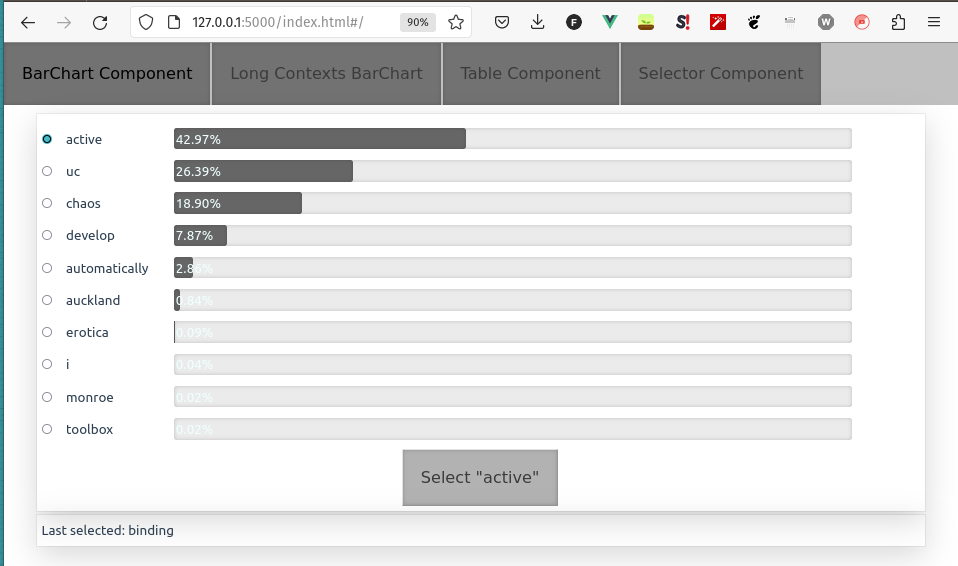
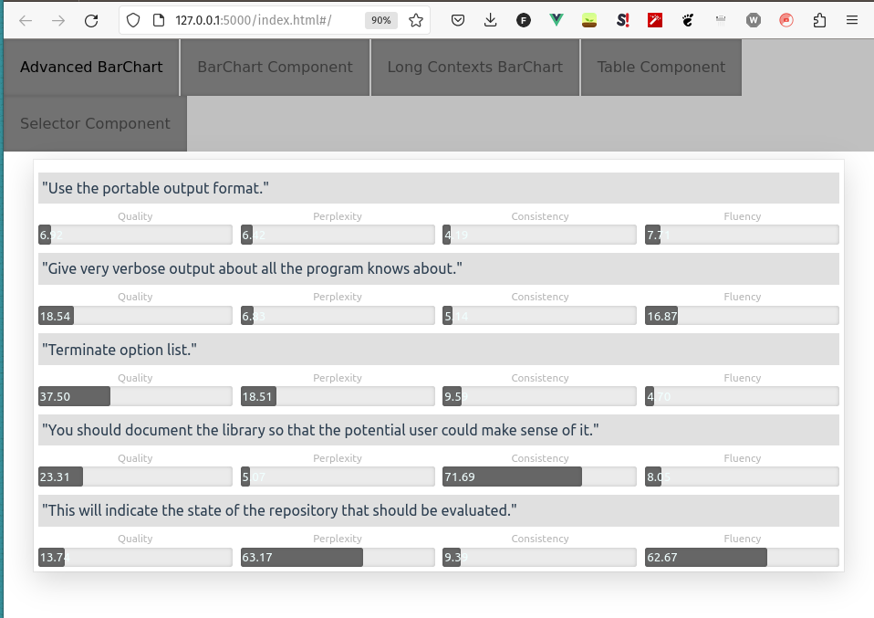

# Modules Example

In this example you can learn about how do individual elements look and how they can be composed to form a more complex components.

## Run command

```sh
flask --app examples_py.example_modules.app run
```

## Implemented Elements

I wrote this library to help me visualize the output distributions of various models I implemented during my master's thesis. Therefore I implemented only few basic elements for ML purposes.

In the following paragraphs I'll explain how to create configuration selectors, tables and bar-charts, and I'll use the following server: (You'll see the implementation of each of yet unknown components)

<!-- MARKDOWN-AUTO-DOCS:START (CODE:src=./app.py&header=# ./app.py)-->
<!-- MARKDOWN-AUTO-DOCS:END-->

### Configuration Selection

Several different kinds of configuration specifier, together with one button element. The button element allows backend communication and by itself it does nothing. However you can specify subelements, for which the button element will provide communication updates. For the example below, the following imports will be used:

<!-- MARKDOWN-AUTO-DOCS:START (CODE:src=./components/selector_component.py&lines=1-11&header=# ./components/selector_component.py lines 1-11)-->
<!-- MARKDOWN-AUTO-DOCS:END-->

#### MinMax SubElement

Input element for setting integer in a range.

<!-- MARKDOWN-AUTO-DOCS:START (CODE:src=./components/selector_component.py&lines=18-20&header=# ./components/selector_component.py lines 18-20)-->
<!-- MARKDOWN-AUTO-DOCS:END-->

#### Choices SubElement

Input element for choosing between several choices.

<!-- MARKDOWN-AUTO-DOCS:START (CODE:src=./components/selector_component.py&lines=21-23&header=# ./components/selector_component.py lines 21-23)-->
<!-- MARKDOWN-AUTO-DOCS:END-->

#### Checkbox SubElement

Simple checkbox input element.

<!-- MARKDOWN-AUTO-DOCS:START (CODE:src=./components/selector_component.py&lines=24-24&header=# ./components/selector_component.py lines 24)-->
<!-- MARKDOWN-AUTO-DOCS:END-->

#### Button Element

This is an element that should encapsulate all the other configuration selection elements. It needs a callback method that will be called when the button is pressed and we provide `ButtonElement.default_select_callback()` which handles processing all the changes sent from the frontend and attributing them to `subelement.selected` properties of subelements.

<!-- MARKDOWN-AUTO-DOCS:START (CODE:src=./components/selector_component.py&lines=30-55&header=# ./components/selector_component.py lines 30-55)-->
<!-- MARKDOWN-AUTO-DOCS:END-->


### Table Element

This element can show several tables on the frontend together with a special feature, links between rows of the tables. They may connect different rows of different tables and display some value above links.
The below example displays, how to generate one table on the frontend with the links pointing from each row to all the upwards rows as displayed on the image.

<!-- MARKDOWN-AUTO-DOCS:START (CODE:src=./components/table_component.py&header=# ./components/table_component.py)-->
<!-- MARKDOWN-AUTO-DOCS:END-->


### Table Element (Advanced)

Let's look at an advanced example of table element, where we create two tables and add links which connect multiple tables. I will only show the important snippets of code.

Firstly, we will import `Colors` enumeration to color links to different tables with different colors.

<!-- MARKDOWN-AUTO-DOCS:START (CODE:src=./components/two_tables_component.py&header=# ./components/two_tables_component.py lines 1-3&lines=1-3)-->
<!-- MARKDOWN-AUTO-DOCS:END-->

Secondly, we will create the links in such a way, that links going within the same table will be colored orange (the default color), while the links going to the other table will be colored light blue. Also links within one table will be thin, while links to the other table will be thick (`Importance` parameter).

<!-- MARKDOWN-AUTO-DOCS:START (CODE:src=./components/two_tables_component.py&header=# ./components/two_tables_component.py lines 43-88&lines=43-88)-->
<!-- MARKDOWN-AUTO-DOCS:END-->


### BarChart Element

This element displays a modular horizontal barchart. It has several configuration options, so I'll try to show-case several of them.

The default bar-chart displays a horizontal selectable bar-chart. It is useful for displaying softmax distributions for the next token prediction. I implemented it in such a way that it is selectable, hence you can navigate the whole process of sequence generation in the same way as the automatic generation would do. Hence this component also implements frontend-backend communication and you can supply an `endpoint_callback` to it.

<!-- MARKDOWN-AUTO-DOCS:START (CODE:src=./components/bar_chart_component_simple.py&lines=1-44&header=# ./components/bar_chart_component_simple.py lines 1-44)-->
<!-- MARKDOWN-AUTO-DOCS:END-->



When you set `long_contexts` option to true, the bar charts will be below the bar titles.


### BarChart Element (Advanced)

This example will display the advanced possibilities I use when e.g. comparing different generation candidates provided by the model.

When I want to compare several candidates, I can display multi-bar-chart, e.g. add multiple bars with different heights, different annotations, each describing one particular quality of the generated sample.

<!-- MARKDOWN-AUTO-DOCS:START (CODE:src=./components/bar_chart_component_advanced.py&lines=1-50&header=# ./components/bar_chart_component_advanced.py lines 1-50)-->
<!-- MARKDOWN-AUTO-DOCS:END-->



### Text Input Element

Allows chat-like interfaces with the models.

<!-- MARKDOWN-AUTO-DOCS:START (CODE:src=./components/text_input_component.py&header=# ./components/text_input_component.py)-->
<!-- MARKDOWN-AUTO-DOCS:END-->


