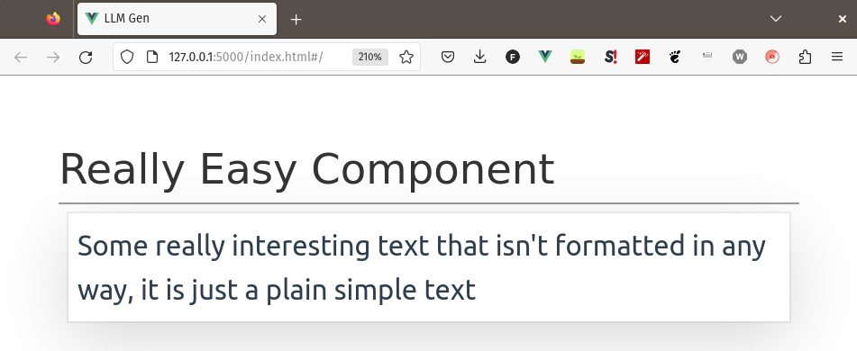

# Simple Example

This is the simplest app which contains only one component with a single element.

## Run command

```sh
flask --app examples_py.simple_app.app run
```

## Module System

The library is composed of three parts:

1. Server - `visuallm.server.Server`
2. Component - `visuallm.component_base.ComponentBase`
3. Elements - `visuallm.elements.*`

## Expected Workflow

1. Create a class inheriting from `visuallm.component_base.ComponentBase`. In `__init__` you should:

- create all the elements from which the page should be composed and add them to the component

<!-- MARKDOWN-AUTO-DOCS:START (CODE:src=./simple_component.py&lines=1-15&header=# ./simple_component.py lines 1-15)-->
<!-- The below code snippet is automatically added from ./simple_component.py -->
```py
# ./simple_component.py lines 1-15
from visuallm.component_base import ComponentBase
from visuallm.elements import MainHeadingElement, PlainTextElement


class SimpleComponent(ComponentBase):
    def __init__(self):
        super().__init__(name="simple_component", title="Simple Component")
        main_heading_element = MainHeadingElement(content="Really Easy Component")
        self.text_element = PlainTextElement(
            content="""
                Some really interesting text that isn't formatted in any way, it is
                just a plain simple text
            """
        )
        self.add_elements([main_heading_element, self.text_element])
```
<!-- MARKDOWN-AUTO-DOCS:END-->

3. Standard method to run the flask application, e.g. for the example provided above, it would be

## Screenshot


